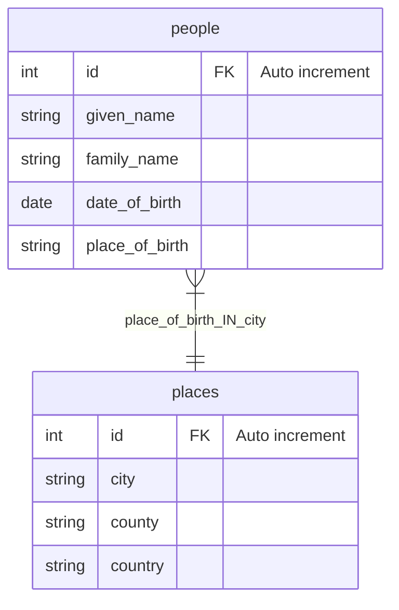

# Data Pipeline

## 1. Software Dependencies

- `Docker`: https://www.docker.com/
- `docker-compose`: https://docs.docker.com/compose/
- `python 3.10`
- `pyspark 3.3.1`
- `mysql 8.0`
- `mysql-connector-java-8.0.28.jar`

## 2. Code Structure
```
.
├── Makefile  # MAKEFILE TO RUN COMMAND
├── README.md
├── data      # DATA FOLDER (INPUT & OUTPUT)
│   ├── example.csv
│   ├── people.csv
│   ├── places.csv
│   ├── sample_output.json
│   └── summary_output.json
├── docker-compose-summary.yml 
├── docker-compose.yml
├── load      # LOAD DATA MODULE
│   ├── Dockerfile
│   ├── data_config.json
│   ├── jars
│   ├── main.py
│   └── requirements.txt
├── schema   # MYSQL DDL TO CREATE DATA SCHEMA
│   └── init.sql
└── summary  # SUMMARY MODULE
    ├── Dockerfile
    ├── jars
    ├── main.py
    └── requirements.txt
```

## 3. How to run?

- <b>Entity Relationship Diagram</b>




- <b>Step 1&2:</b> Stand-up `Mysql` server - run `schema/init.sql` to create database schema - run `load data` pyspark job to ingest `data/people.csv` and `data/places.csv` to Mysql
```bash
make up_db_load_data
``` 

- <b>Step 3:</b> Get summary data
```bash
make summary
```

- Shutdown `Docker` container
```bash
make down
```

### Notes: 
There is an assumption that the pipeline would run one time with append mode (or just insert data into the tables). Therefore, if we run multiple times the data will be duplicated.

If you wish to clean up all the inserted data, please use this command:
```bash
docker-compose down -v
``` 

Lastly, `.env` has been used to store the database credential, in production we should not push this file into `github`
